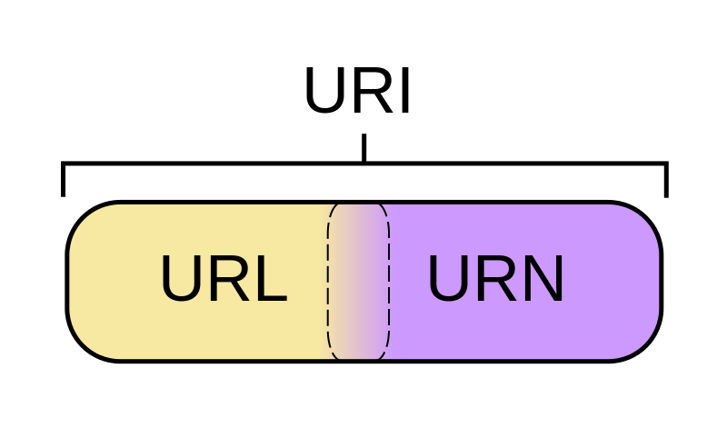

# Read Me First
The following was discovered as part of building this project:

* The original package name 'com.imooc.first-app-demo-230' is invalid and this project uses 'com.imooc.firstappdemo230' instead.

# Getting Started

### Reference Documentation
For further reference, please consider the following sections:

* [Official Apache Maven documentation](https://maven.apache.org/guides/index.html)
* [Spring Boot Maven Plugin Reference Guide](https://docs.spring.io/spring-boot/docs/2.3.0.BUILD-SNAPSHOT/maven-plugin/)

# 项目中的要点解释
## @Autowired
@Autowired 注释，它可以对类成员变量、方法及构造函数进行标注，完成自动装配的工作。 通过 @Autowired的使用来消除 set ，get方法。暂时还不是非常理解，在这里放上一个解释这个现象的链接，方便以后查看<https://www.cnblogs.com/fnlingnzb-learner/p/9723834.html>

## URL和URI的区别
URI包括URL和URN两个类别，URL是URI的子集，所以URL一定是URI，而URI不一定是URL
URI = Universal Resource Identifier 统一资源标志符，用来标识抽象或物理资源的一个紧凑字符串。
URL = Universal Resource Locator 统一资源定位符，一种定位资源的主要访问机制的字符串，一个标准的URL必须包括：protocol、host、port、path、parameter、anchor。
URN = Universal Resource Name 统一资源名称，通过特定命名空间中的唯一名称或ID来标识资源。

举个栗子：
>个人的身份证号就是URN，个人的家庭地址就是URL，URN可以唯一标识一个人，而URL可以告诉邮递员怎么把货送到你手里。  

再举个栗子：
>http://blog.csdn.net/koflance是个URL，通过这个网址可以告诉CDN找到我的博客所在地，并且还告诉用HTTP协议访问，而isbn:0-395-36341-1是RUN，一个国际标准书号，可以唯一确定哪本书。
目前HTTP规范已经不使用URL，而是使用URI了，所以使用URI准没错！

## 项目配置教程
<https://blog.csdn.net/weixin_40304882/article/details/104619865> 